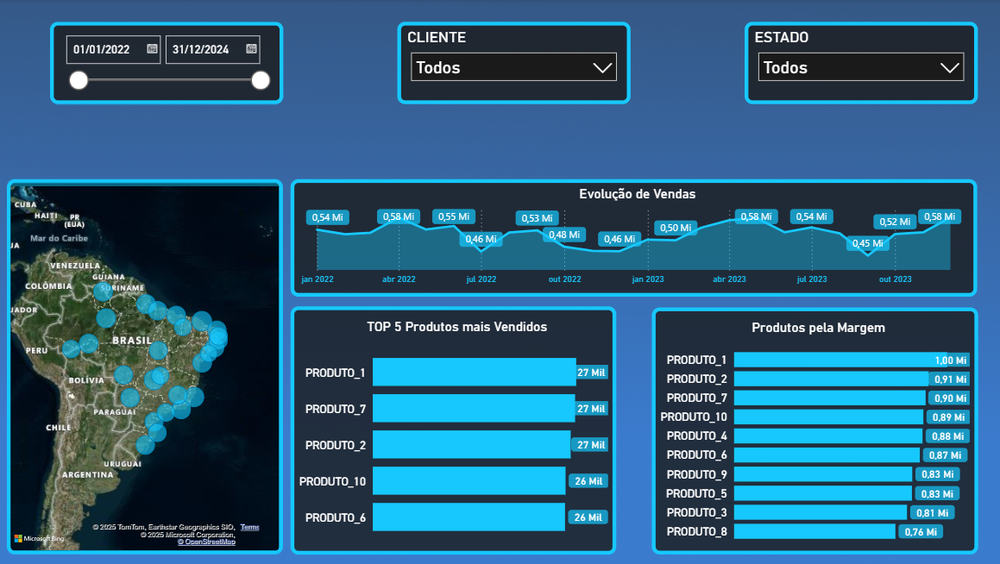

# 📊 Dashboard de Vendas

---

## 📌 Sobre o Projeto
Este repositório contém um **dashboard interativo de vendas** desenvolvido no Power BI.  
O objetivo é monitorar métricas comerciais, identificar padrões de consumo e auxiliar na **tomada de decisões estratégicas**.

Foram utilizadas técnicas de **modelagem de dados**, **DAX** para criação de medidas analíticas e **Power Query** para tratamento da base.  
O projeto simula um cenário de vendas, com foco em **receita, produtos e margem de lucro**.

---

## 🔍 Perguntas Respondidas no Projeto
- Qual é o total de vendas por estado?
- Quais são os 5 produtos mais vendidos (em quantidade) e qual é a receita gerada por eles?
- Qual a margem de lucro dos produtos?
- Qual foi o desempenho de vendas ao longo do tempo (mês a mês)?
- Qual cliente gerou a maior receita total e qual é sua localização?
---

## 🚀 Tecnologias Utilizadas
- **Power BI Desktop**  
- **Power Query** (ETL – Extração, Transformação e Carga)  
- **DAX (Data Analysis Expressions)**  
- **Modelagem de Dados**

---

## 📂 Estrutura do Repositório
- `Dashboard Vendas.pbix` → Arquivo principal do dashboard (abrir no **Power BI Desktop**)  
- `Vendas.png` → Imagem prévia do dashboard  

---

## 📈 Relatório

### 🔹 Dashboard de Vendas

---

## 🔎 Como Utilizar
1. Baixe o arquivo `Dashboard Vendas.pbix`  
2. Abra no **Power BI Desktop**  
3. Explore os relatórios e interaja com os filtros  

---

✍️ Desenvolvido por **Patrícia Rocha**  
